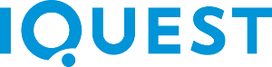
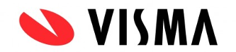
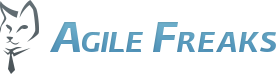

# Coderetreat Sibiu

This is the starter kit for the code retreat

# What is a coderetreat?

Coderetreat is a day-long, intensive practice event, focusing on the fundamentals of software development and design. By providing developers the opportunity to take part in focused practice, away from the pressures of 'getting things done', the coderetreat format has proven itself to be a highly effective means of skill improvement. Practicing the basic principles of modular and object-oriented design, developers can improve their ability to write code that minimizes the cost of change over time.

For an in-depth understanding of the philosophy behind a day of coderetreat, please watch this [introduction video](https://vimeo.com/18955165).

For even more details take a look at the [official page](http://coderetreat.org).
 
# What do I need in order to participate?

Your development env, laptop, favourite keyboard or toy.
Before you get to the venue make sure to clone this repo an setup the enviroments you want to work on. You will find a convinient readme with the instructions in each of the folders.

# Cool, when is the next one happening?

Funny you should ask that, the next one is happening on the 14 of november, you can book you place on [facebook](https://www.facebook.com/events/857575417689098/) or on [the code retreat site](http://coderetreat.org/events/sibiu-global-day-of-code-retreat)

# How to contribute

We are always looking for starter kits in other languages, so please submit your pull requests. Here are the steps to follow:

- Create a folder with the name of the language (Ex: csharp, vb, scala, phyton)
- Add a README.md in the new folder that contains the instructions to setup, keep in mind that the developers that want to try this out might have never worked with this language, make it easy for them to see how cool it is.
- Create a scaffold project that only has a work file (a empty class in oop languages) and a simple test.
- Submit a pull request.

# Sponsors

Big thanks to the our sponsors:

  
